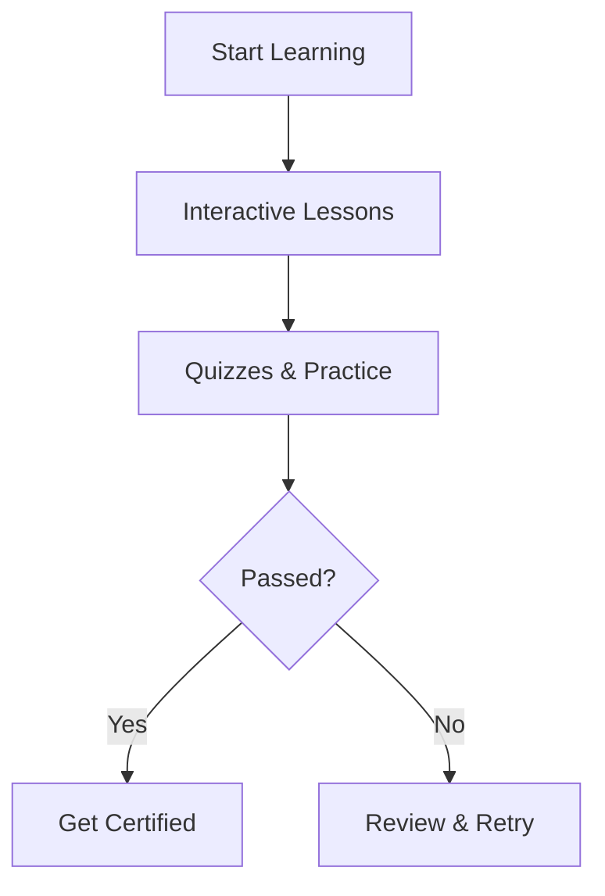

# **LearnSphere Brand README**  
*(Modern, Interactive & Data-Driven Learning Platform)*  

---

## **🚀 Brand Overview**  
**LearnSphere** – bu **innovatsion o‘quv va testlash platformasi** bo‘lib, foydalanuvchilarga barcha sohalar bo‘yicha sifatli bilim olish va o‘zlarini sinab ko‘rish imkoniyatini beradi. Bizning asosiy maqsad – **"O‘rgan, Testdan O‘t, Rivojlan"** prinsipiga asoslangan zamonaviy ta’lim ekotizimini yaratish.  

---

## **🎨 Brand Identity**  

### **1. Logo & Visual Style**  
- **Logo:** Minimalist, tech-inspired design with:  
  - **Globe + Brain** (global knowledge)  
  - **Binary Code / Puzzle Pieces** (interactive learning)  
- **Colors:**  
  - **Primary:** `#2563EB` (Deep Blue) + `#10B981` (Vibrant Green)  
  - **Secondary:** Gradient Purple (`#7C3AED` → `#EC4899`)  
- **Typography:** **Poppins (Bold for headers, Medium for body)**  

 *(Example: Replace with actual logo)*  

### **2. Motion & Animation**  
- **Micro-interactions:**  
  - **Loading spinner** (atom-inspired circular animation)  
  - **Success Checkmark** (smooth Lottie animation after test completion)  
- **Hero Section Animation:**  
  - Floating **3D book icons** with particle effects (representing dynamic learning)  

 *(Example: Animated SVG/GSAP)*  

---

## **📊 Key Features (Diagrams)**  

### **1. LearnSphere Workflow**  

### **2. AI-Powered Testing System**  
 *(Concept: AI auto-generates adaptive tests)*  

---

## **🎯 Core Principles**  
✅ **1. Learn** → Barcha sohalar bo‘yicha strukturli darsliklar  
✅ **2. Test** → Real vaqtda bilimni tekshirish  
✅ **3. Grow** → Har bir foydalanuvchi uchun shaxsiy statistika  

---

## **📱 Platform UI Examples**  
| Section | Preview |  
|---------|---------|  
| **Dashboard** |  |  
| **Quiz Interface** |  |  

---

## **✨ Why LearnSphere?**  
- **Zamonaviy UI/UX** (Gamification elements: Badges, Leaderboards)  
- **AI-Driven Testing** (Adaptive difficulty, instant feedback)  
- **Multi-Platform** (Web, Mobile, Telegram Bot)  

---

## **📂 Brand Assets**  
- [Download Logo Pack (.SVG, .PNG)](link_here)  
- [Style Guide (Colors, Fonts)](link_here)  
- [Lottie Animations](link_here)  

---  

**🔗 Contact:** [hello@learnsphere.vercel.app](mailto:hello@learnsphere.uz) | [@LearnSphereUz](https://t.me/LearnSphereUz)  

---  

### **🎉 "O‘rganing, Sinab Ko‘ring, O‘sing!"**  
*(Learn, Test, Grow!)*  

---  